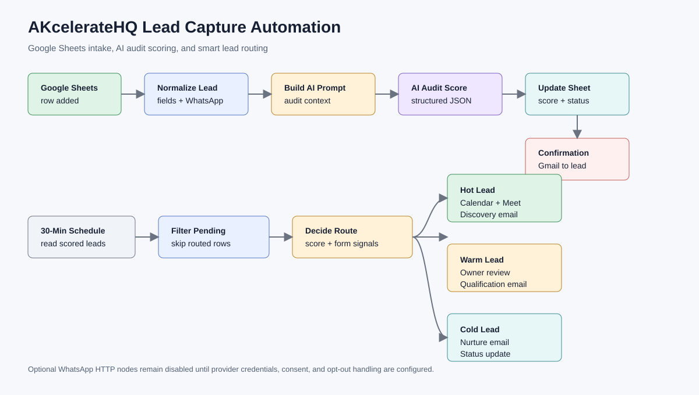

# Project 01 - AKcelerateHQ Lead Capture Automation

Portfolio case study for an n8n automation that turns automation-audit form responses into scored, routed sales follow-up. The workflow reads new rows from an `Audit Leads` Google Sheet, normalizes contact data, uses an AI agent with structured output for audit scoring, writes the result back to the sheet, sends confirmation email, and routes leads through discovery, manual review, or nurture paths.



## Business Outcome

The project replaces manual lead review with a repeatable intake and routing system. A business owner can receive new audit requests, identify high-intent leads faster, schedule discovery calls for strong-fit prospects, and avoid spending the same effort on low-intent submissions.

## What The Workflow Does

- Captures new Google Sheet rows from the AKcelerateHQ automation-audit intake.
- Filters already-processed rows and submissions missing required name, email, or company fields.
- Normalizes WhatsApp/phone values and maps inconsistent form headers into stable internal fields.
- Builds an AI audit-scoring prompt from business pain, tools, budget, timeline, authority, and data readiness.
- Uses an n8n AI Agent, OpenAI Chat Model, and Structured Output Parser to return a controlled JSON score.
- Updates the `Audit Leads` sheet with `audit_score`, `lead_category`, owner, status, next action, and notes.
- Sends a confirmation email to the lead.
- Runs a scheduled smart-routing pass every 30 minutes.
- Routes hot leads to a Google Calendar discovery call and discovery email.
- Routes warm leads to owner review plus qualification email.
- Routes cold leads to a nurture email.
- Keeps optional WhatsApp HTTP nodes disabled until a provider token and compliance process are configured.

## Main Workflow Paths

| Path | Trigger | Output |
|---|---|---|
| AI audit scoring | New row in `Audit Leads` | Normalized row, AI score, lead category, recommended offer, confirmation email |
| Smart routing | 30-minute schedule | Discovery call, manual review, or nurture status update |
| Hot lead | Score/category and form signals show strong fit | Calendar event, Google Meet link, discovery email, sheet status `Discovery Scheduled` |
| Warm lead | Useful fit but missing scope, authority, budget, or timing clarity | Owner review email, qualification email, sheet status `Manual Review` |
| Cold lead | Low urgency, weak budget, unclear ROI, or early exploration | Nurture email, sheet status `Nurture` |

## Files

| File | Purpose |
|---|---|
| `workflows/akceleratehq-lead-capture-automation.public.json` | Sanitized n8n workflow export for review/import |
| `docs/setup-guide.md` | Import, credential, placeholder, and test steps |
| `docs/security-notes.md` | Public repo safety notes and credential handling |
| `docs/business-case.md` | Business problem, value, and hiring-manager review notes |
| `docs/field-map.md` | Input and output fields expected by the workflow |
| `docs/operations-and-error-handling.md` | Existing workflow controls and production hardening plan |
| `docs/akceleratehq-automation-audit-crm-template.public.xlsx` | Sanitized workbook/template for the `Audit Leads` sheet |
| `sample-data/audit-leads.sample.csv` | Realistic mock submissions for local review |
| `scripts/simulate_lead_routing.py` | Offline scoring/routing simulation with no external APIs |
| `output-samples/routed-leads.sample.csv` | Generated sample output from the offline simulation |
| `assets/workflow-map.svg` | Project workflow map matching the public export |

## Offline Validation

Run the local simulation from the repository root:

```bash
python 01-akceleratehq-lead-capture-automation/scripts/simulate_lead_routing.py
```

Or from this project folder:

```bash
python scripts/simulate_lead_routing.py
```

The script reads `sample-data/audit-leads.sample.csv`, applies deterministic scoring and routing rules modeled after the n8n workflow, and writes `output-samples/routed-leads.sample.csv`. It does not call Google, Gmail, Calendar, OpenAI, or WhatsApp APIs.

## Credential Status

The workflow export is inactive and sanitized for public review. To run it in n8n, connect Google Sheets, Gmail, Google Calendar, and OpenAI credentials, replace placeholders documented in the setup guide, and only enable WhatsApp HTTP nodes after adding a provider token and consent controls.
