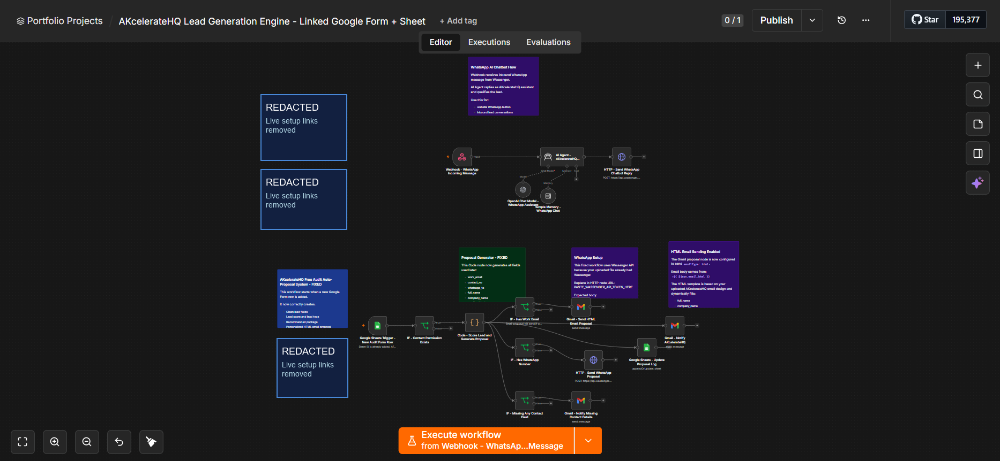

# Project 01 - AKcelerateHQ Lead Generation Engine

Portfolio case study for an n8n lead intake and follow-up automation. The system connects a Google Form and Google Sheets backend with AI-assisted lead scoring, proposal generation, Gmail delivery, WhatsApp follow-up, internal notifications, and an inbound WhatsApp chatbot path.

## Implementation Summary

The workflow starts when a new Google Form response reaches the linked Google Sheet. It normalizes the submitted fields, scores the lead, classifies the opportunity, generates a personalized proposal summary, sends follow-up messages through available channels, writes status back to a proposal log, and alerts the owner for next action.

It also includes a separate WhatsApp webhook path where inbound WhatsApp messages are handled by an AI assistant that qualifies leads and replies through Wassenger.

## Connected Form

Owner-access Google Form configuration:

https://docs.google.com/forms/d/1_AVbRMX2Zg6QNvDy--bsAelCtkCoHuaPF0LdmwLokok/edit

The public workflow export still uses placeholders for sheet IDs, credentials, and API tokens. The form link is documented here as the connected implementation reference.

## What This Demonstrates

- End-to-end automation design from lead capture to follow-up.
- Google Forms and Google Sheets as a lightweight CRM intake layer.
- Data cleaning and fuzzy field mapping for inconsistent form headers.
- Lead scoring based on budget, timeline, authority, urgency, and manual work impact.
- Branching logic for email, WhatsApp, proposal logging, and missing-contact handling.
- AI assistant integration for WhatsApp lead qualification.
- Portfolio-safe packaging with credential references removed.

## Main Workflow Paths

| Path | Trigger | Output |
|---|---|---|
| Free audit auto-proposal | New Google Sheets row from Google Form | Lead score, lead category, HTML email proposal, WhatsApp message, proposal log row, internal owner alert |
| WhatsApp AI chatbot | Wassenger inbound WhatsApp webhook | AI-generated WhatsApp reply and lead qualification flow |

## Files

| File | Purpose |
|---|---|
| `workflows/akceleratehq-lead-generation-engine.public.json` | Sanitized n8n workflow export for review/import |
| `docs/akceleratehq-automation-audit-crm-template.public.xlsx` | Sanitized CRM workbook/template used for lead tracking and scoring |
| `docs/setup-guide.md` | Import and configuration steps |
| `docs/security-notes.md` | Public repo safety notes and credential handling |
| `assets/workflow-preview-redacted.png` | Redacted workflow screenshot for portfolio review |

## Tech Stack

- n8n workflow automation
- Google Forms and Google Sheets
- Gmail OAuth node
- OpenAI chat model node
- Wassenger WhatsApp API
- JavaScript Code node for scoring, mapping, and proposal generation

## Review Notes

The export is intentionally not active by default. To run it, import the workflow into n8n, connect Google Sheets, Gmail, OpenAI, and WhatsApp credentials, then replace placeholder IDs and tokens in the setup guide.
