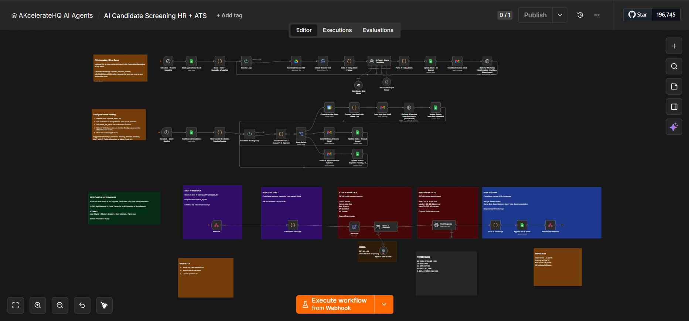

# Project 02 - AI Candidate Screening HR + ATS

Portfolio case study for an n8n hiring automation that screens AI automation candidates, scores resume fit, routes candidates through an ATS-style workflow, and stores AI interview evaluation results.



## Business Outcome

Hiring for AI automation roles creates a high-review workload because applicants often mix web development, no-code automation, AI API usage, and project claims in inconsistent formats. This workflow turns a Google Form and hiring sheet into a structured screening queue so HR can identify strong candidates quickly while keeping manual approval for uncertain or weak candidates.

## What The Workflow Does

- Reads new candidate applications from the `Applications` sheet.
- Normalizes WhatsApp/phone values and filters already-processed rows.
- Downloads the candidate resume PDF from Google Drive.
- Extracts resume text and builds an AI hiring-score prompt.
- Uses an n8n AI Agent with OpenRouter and a Structured Output Parser for controlled scoring JSON.
- Updates the hiring sheet with `ai_score`, `ai_category`, summaries, strengths, weaknesses, risk flags, and interview questions.
- Sends an application confirmation email.
- Runs a scheduled smart-routing pass for scored candidates.
- Routes strong candidates to Google Calendar interview scheduling and interview email.
- Routes average candidates to HR manual review.
- Routes weak candidates to HR approval before rejection instead of sending automatic rejection.
- Includes a webhook-based AI interview evaluator that parses interview transcripts and stores structured interview scores.
- Keeps optional WhatsApp HTTP nodes disabled until a provider, consent, and opt-out process are configured.

## Main Workflow Paths

| Path | Trigger | Output |
|---|---|---|
| Resume screening | Scheduled ingestion | Resume text, AI score, category, summary, sheet update, confirmation email |
| Smart routing | Scheduled scored-candidate review | Interview, manual review, or HR approval status |
| Interview route | Strong candidate | Calendar event, Google Meet link, interview email, `Interview Scheduled` status |
| Manual review route | Average or unclear candidate | HR review email and `Manual Review` status |
| HR approval route | Weak candidate | HR approval email and `Rejection Pending HR Approval` status |
| AI interview evaluator | Webhook transcript | Structured interview score appended to evaluation sheet |

## Files

| File | Purpose |
|---|---|
| `workflows/ai-candidate-screening-hr-ats.public.json` | Sanitized n8n workflow export for review/import |
| `assets/workflow-preview.png` | Current n8n workflow screenshot |
| `docs/ai-automation-hiring-template.public.xlsx` | Sanitized Google Sheet workbook template |
| `docs/ai-automation-hiring-application-form.pdf` | Exported Google Form reference |
| `docs/setup-guide.md` | Import and configuration steps |
| `docs/security-notes.md` | Credential, candidate-data, and public repo safety notes |
| `docs/business-case.md` | Business value and hiring-manager review notes |
| `docs/field-map.md` | Application, scoring, routing, and interview output fields |
| `docs/operations-and-error-handling.md` | Human approval and production hardening notes |
| `docs/demo-guide.md` | Reviewer walkthrough |
| `sample-data/candidates.sample.csv` | Fictional candidate applications for local review |
| `sample-data/interview-transcript.sample.txt` | Mock AI interview transcript |
| `scripts/simulate_candidate_screening.py` | Offline simulation with no external APIs |
| `output-samples/screened-candidates.sample.csv` | Generated candidate routing output |
| `output-samples/interview-evaluation.sample.json` | Generated interview scoring output |

## Offline Validation

Run from the repository root:

```bash
python 02-ai-candidate-screening-hr-ats/scripts/simulate_candidate_screening.py
```

Or from this project folder:

```bash
python scripts/simulate_candidate_screening.py
```

The script reads the sample candidates and transcript, applies deterministic scoring/routing rules modeled after the n8n workflow, and writes output samples. It does not call Google, Gmail, Calendar, OpenRouter, OpenAI, Vapi, or WhatsApp APIs.

## Credential Status

The workflow export is inactive and sanitized for public review. To run it in n8n, connect Google Sheets, Google Drive, Gmail, Google Calendar, OpenRouter, and OpenAI credentials, replace placeholders documented in the setup guide, and only enable WhatsApp HTTP nodes after consent and opt-out handling are configured.
