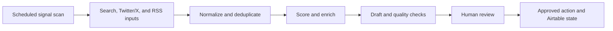

# AI Lead Intelligence & Sales Automation

> AI-Assisted Lead Discovery, Enrichment, and Sales Outreach

**Technical identifier:** LeadGen Engine  
**Business domain:** Sales and lead operations  
**System type:** Automation system prototype  
**Status:** Workflow prototype; validation required

## Business Problem

Sales teams may spend significant time finding relevant public signals, researching prospects, enriching records, and preparing first responses. The operating challenge is to organize those steps while keeping outreach decisions reviewable and compliant with channel policies.

## What This System Does

The workflow is designed around scheduled public-signal ingestion, intent detection, lead enrichment, competitor intelligence, AI-assisted drafting, human approval, nurture state, and evaluation. The export includes search and RSS input patterns, Twitter/X requests, code transformations, Airtable state operations, OpenAI and Anthropic HTTP calls, Slack review, Gmail, switches, schedules, and an error trigger.

The repository does not verify lead volumes, reply rates, demos, costs, or deployment results.

## How It Can Be Customized

A company could adapt signal sources, qualification rules, enrichment providers, CRM schema, approval roles, outreach channels, opt-out handling, nurture policy, and evaluation criteria. Source permissions, terms of service, rate limits, and messaging controls must be assessed for each implementation.

## Technical Architecture

The 87-node export contains Airtable, code, HTTP Request, RSS, Slack, Gmail, schedule, switch, conditional, merge, no-op, sticky-note, and error-trigger nodes. AI responsibilities should remain bounded to classification, extraction, and draft generation until evaluated.

## Delivery Readiness

**Demonstrated:** Scheduled orchestration, multiple input adapters, state operations, AI/API patterns, Slack review patterns, and error-trigger structure.  
**Dependencies:** Search and social API access, enrichment credentials, model access, CRM schema, consent/opt-out rules, and operator ownership.  
**Missing validation:** Source replay, deduplication, retry/backoff, rate limits, model evaluation, outreach safety, audit logs, and end-to-end acceptance.  
**Production risk:** Human-review behavior must be tested to ensure no sending path bypasses the intended approval control.

## Next Steps

1. Define permitted sources, qualification rules, and outreach policy.
2. Test representative, duplicate, malformed, and provider-failure inputs.
3. Validate model outputs against approved examples and rejection cases.
4. Confirm approval, logging, rate-limit, and opt-out controls before activation.

## Screenshots and Files

- [Full workflow canvas](assets/canvas-full.png)
- [Ingestion and intent](assets/canvas-part1.png)
- [Enrichment and intelligence](assets/canvas-part2.png)
- [AI and human review](assets/canvas-part3.png)
- [State and evaluation](assets/canvas-part4.png)
- [LeadGen Engine workflow export](LeadGen-Engine-Workflow.json)

[Portfolio home](../README.md) · [Projects index](../PROJECTS.md) · [Readiness checklist](../docs/IMPLEMENTATION-READINESS.md)
