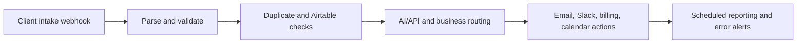

# Client Operations & Retention OS

> Business Operations Automation for Agencies and Service Businesses

**Technical identifier:** AgencyOS  
**Business domain:** Agencies and service businesses  
**System type:** Automation system prototype  
**Status:** Workflow prototype; validation required

## Business Problem

Agencies often manage client intake, proposals, project delivery, communication, billing, scheduling, and retention across separate tools. This can create manual handoffs, inconsistent records, and limited visibility for account leads.

## What This System Does

The workflow export is structured around client intake, proposal generation, project operations, communication, invoicing, scheduling, review collection, client health signals, lead nurture, financial reporting, onboarding, and error handling. It includes intake validation, duplicate-check patterns, Airtable state operations, scheduled triggers, routing, notifications, AI/API steps, and an error trigger.

## How It Can Be Customized

The system could be adapted to a company’s CRM, project-management tool, billing provider, approval owners, client lifecycle rules, data retention policy, and reporting cadence. Those adaptations require discovery, schema mapping, credentials, and testing; they are not all implemented by the portfolio export.

## Technical Architecture

The 168-node export includes Airtable, code, Gmail, HTTP Request, Slack, Google Calendar, Notion, Stripe, Twilio, wait, schedule, webhook, switch, conditional, sticky-note, and error-trigger nodes. Exact behavior depends on configured credentials, schemas, and connected services.

## Delivery Readiness

**Demonstrated:** Inspectable workflow structure, modular business areas, triggers, transformations, routing, service nodes, Airtable operations, and error-trigger structure.  
**Dependencies:** Service credentials, data schemas, approval owners, provider limits, and environment configuration.  
**Missing validation:** End-to-end execution, duplicate replay, retries, provider failures, logging, permissions, recovery, and user acceptance testing.  
**Production risk:** The export alone does not prove a live deployment, client result, compliance approval, or support history.

## Next Steps

1. Confirm the target agency process and source-of-truth systems.
2. Map real data schemas and configure isolated test credentials.
3. Test normal, duplicate, invalid, timeout, and approval scenarios.
4. Verify monitoring, rollback, access control, and handover procedures.

## Screenshots and Files

- [Full workflow canvas](assets/canvas-full.png)
- [Modules 01-04](assets/canvas-part1.png)
- [Modules 05-08](assets/canvas-part2.png)
- [Modules 09-12](assets/canvas-part3.png)
- [AgencyOS workflow export](AgencyOS-Workflow.json)

[Portfolio home](../README.md) · [Projects index](../PROJECTS.md) · [Security and reliability](../SECURITY-AND-RELIABILITY.md)
