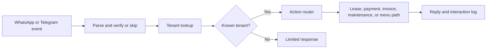

# Property Management & Tenant Service Automation

> WhatsApp-Based Tenant Support and Property Operations

**Technical identifier:** ZedProp  
**Business domain:** Property management and tenant services  
**System type:** Automation system with channel demo  
**Status:** Demo implementation; validation required

## Business Problem

Property teams repeatedly answer questions about leases, rent, invoices, and maintenance while protecting tenant information. A structured tenant-service channel can organize common requests, route them consistently, and create records for follow-up.

## What This System Does

The WhatsApp workflow parses inbound events, handles verification or skipped events, looks up a tenant in Airtable, distinguishes known and unknown users, routes action identifiers, supports lease and payment-related responses, generates documents through a PDF API pattern, creates maintenance records, sends channel responses, and records interactions. The Telegram file is an adapted demonstration variant.

## How It Can Be Customized

A property operator could adapt tenant identity rules, property and lease schemas, permitted actions, document templates, payment-status data, maintenance routing, escalation rules, communication channels, and retention policies. High-risk disclosures and changes require stronger authentication and authorization than a phone lookup alone.

## Technical Architecture

The exports contain WhatsApp webhook or Telegram trigger nodes, JavaScript parsing, Airtable search, conditional routing, action switches, PDF conversion API patterns, messaging requests, and interaction logging. Placeholder configuration and hardcoded-looking identifiers require review before sharing or deployment.

## Delivery Readiness

**Demonstrated:** Channel parsing, verification/skip logic, tenant lookup, routing, document-generation pattern, maintenance path, and interaction logging.  
**Dependencies:** Channel credentials, Airtable schema, document service, tenant authorization rules, webhook exposure, and data-retention policy.  
**Missing validation:** Webhook signatures, identity and authorization, replay/idempotency, document access, rate limits, personal-data handling, error recovery, and acceptance testing.  
**Production risk:** A phone-number lookup is not sufficient authorization for every tenant or financial disclosure.

## Next Steps

1. Define permitted tenant actions and authorization requirements.
2. Remove or replace sample identifiers and configure isolated test credentials.
3. Test unknown users, duplicate events, unauthorized actions, document delivery, and provider failures.
4. Review personal-data retention, logging, access control, and recovery procedures.

## Screenshots and Files

- [Full workflow canvas](assets/canvas-full.png)
- [Routing and intake](assets/canvas-part1.png)
- [PDF and communication](assets/canvas-part2.png)
- [Logging and maintenance](assets/canvas-part3.png)
- [ZedProp WhatsApp workflow](ZedProp-Unified-Workflow.json)
- [ZedProp Telegram demo](ZedProp-Telegram-Demo.json)

[Portfolio home](../README.md) · [Projects index](../PROJECTS.md) · [Security and reliability](../SECURITY-AND-RELIABILITY.md)
