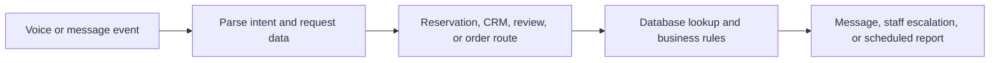

# Restaurant Revenue & Guest Experience Automation

> Hospitality Operations, Reservations, and Guest Engagement Automation

**Technical identifier:** RestoFlow  
**Business domain:** Hospitality operations  
**System type:** Automation system prototype with demo variant  
**Status:** Deployment and outcomes unverified

## Business Problem

Restaurant teams coordinate reservations, phone and messaging requests, guest information, reviews, promotions, and daily reporting while managing table capacity and staff attention. Disconnected handoffs can make it harder to respond consistently and recover cancelled or problematic interactions.

## What This System Does

The primary workflow and demo cover voice or message intake, reservation and no-show-related routing, WhatsApp-oriented conversations, customer records, loyalty concepts, review monitoring, promotional approval patterns, and operational reporting. The export includes webhook parsing, switch-style routing, code nodes, Airtable operations, messaging/API patterns, scheduled triggers, Slack notifications, review-related requests, and AI HTTP calls.

Client names, financial amounts, performance improvements, and testimonials appearing in workflow notes are not treated as verified results.

## How It Can Be Customized

A restaurant could adapt booking rules, table inventory, channels, menu and order flows, CRM fields, loyalty rules, review handling, promotional limits, staff approvals, and reporting cadence. Availability consistency, payment handling, consent, opt-outs, and provider terms must be validated for the target operation.

## Technical Architecture

The repository contains a primary workflow export and a Telegram demo variant, plus visual assets. Exact module behavior and provider compatibility require execution tests with real schemas and isolated credentials.

## Delivery Readiness

**Demonstrated:** Channel intake patterns, routing, scheduled operations, data-storage patterns, communication paths, and a demo variant.  
**Dependencies:** Messaging and voice providers, reservation data, staff ownership, payment configuration, review access, and customer communication rules.  
**Missing validation:** Availability concurrency, duplicate reservations, cancellation recovery, retries, provider outages, opt-outs, rate limits, payment handling, logs, and approvals.  
**Production risk:** The repository does not evidence a verified client deployment, measured operational outcome, or support history.

## Next Steps

1. Map the restaurant’s reservation, messaging, and guest-service process.
2. Validate availability, cancellation, waitlist, payment, and escalation rules.
3. Test normal, duplicate, concurrent, timeout, and provider-error scenarios.
4. Confirm consent, opt-out, monitoring, and staff handover procedures.

## Screenshots and Files

- [System overview](assets/overview.png)
- [Canvas part 1](assets/canvas-part1.png)
- [Canvas part 2](assets/canvas-part2.png)
- [Canvas part 3](assets/canvas-part3.png)
- [RestoFlow workflow export](RestoFlow-Workflow.json)
- [Telegram demo workflow](RestoFlow-Telegram-Demo.json)

[Portfolio home](../README.md) · [Projects index](../PROJECTS.md) · [Delivery approach](../DELIVERY-APPROACH.md)
